# UTR-Diffusion

Official implementation accompanying the manuscript:

> **UTR-Diffusion: Conditional Diffusion Modeling for Multi-objective and Constrained UTR Design**

UTR-Diffusion generates 50-nt 5′ UTR and 5′ UTR–CDS junction sequences. The released masked continuous multi-label (MCML) model supports:

- unconditional generation;
- single-label MRL or MFE conditioning;
- joint MRL–MFE conditioning;
- exact codon constraints at user-selected nucleotide positions;
- sparse amino-acid constraints with synonymous-codon flexibility; and
- CAI-guided generation for a complete amino-acid-constrained CDS suffix.

## Installation

```bash
git clone https://github.com/sato-lab-org/utr-diffusion.git
cd utr-diffusion
conda env create -f environment.yaml
conda activate utr-diffusion
```

The released sampling path was validated with CUDA and FP16. The optional MFE evaluation also requires `RNAfold`, which is installed by the ViennaRNA dependency in `environment.yaml`.

## Final MCML checkpoint

The final model is hosted at [chuankai-dai/utr-diffusion-checkpoint](https://huggingface.co/chuankai-dai/utr-diffusion-checkpoint). Download it to the repository-local `checkpoints/` directory:

```bash
hf download chuankai-dai/utr-diffusion-checkpoint checkpoints/mcml_epoch_2000.pt --local-dir .
```

The default path used by `demo.py` is `checkpoints/mcml_epoch_2000.pt`.

- Model SHA-256: `7125d9aa94ac67a71801c26364ce9df517a150a2e19b282caf317c835ae73ba0`
- Bundled evaluation model SHA-256: `b527c4283328dced156eb11f1e8ca748de68c14f8dcdd4079872db1a0b42d828`

The 1.38 GB generative checkpoint is intentionally not stored in Git. The small evaluation model at `evaluation/Model/model.pt` is bundled so `--do-eval` works without another model download.

## Design examples

MRL and MFE each accept one target value. They may be used independently, together, or omitted for unconditional generation. For stable interpolation, use targets near the training distribution:

| Label | Training-data range | Recommended demo range |
| --- | ---: | ---: |
| MRL | 0 to 12 | 2 to 9 |
| MFE | -31 to 0 | -30 to 0 |

### 1. Unconditional generation

Omitting both MRL and MFE samples from the model's unconditional path.

```bash
python demo.py --do-eval --out demo_output/unconditional.fasta
```

Result: unconditional MRL–MFE distribution.

<p align="center">
  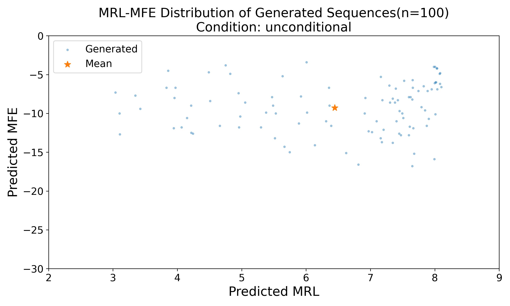
</p>

### 2. Single-label MRL generation

```bash
python demo.py --mrl 6 --do-eval --out demo_output/mrl_demo.fasta
```

Result: predicted MRL distribution with the requested MRL target.

<p align="center">
  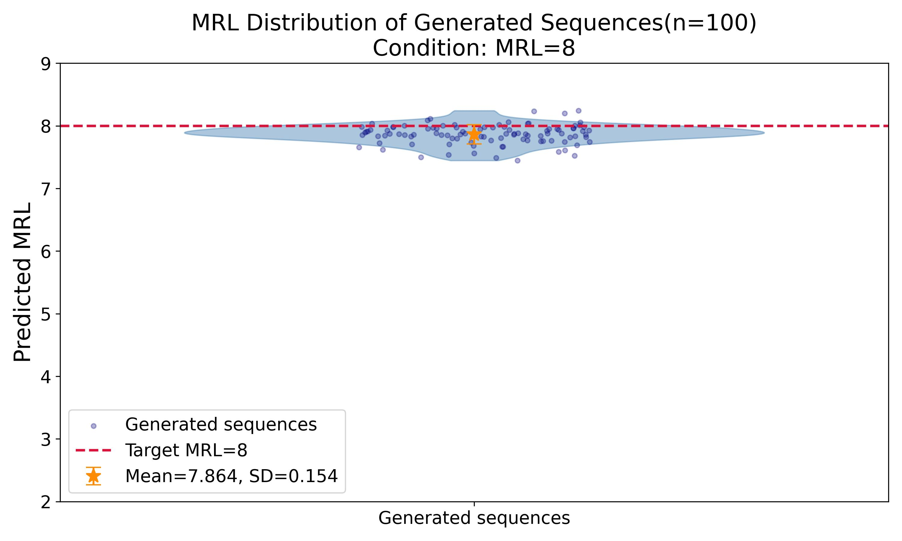
</p>

### 3. Single-label MFE generation

```bash
python demo.py --mfe -10 --do-eval --out demo_output/mfe_demo.fasta
```

Result: predicted MFE distribution with the requested MFE target.

<p align="center">
  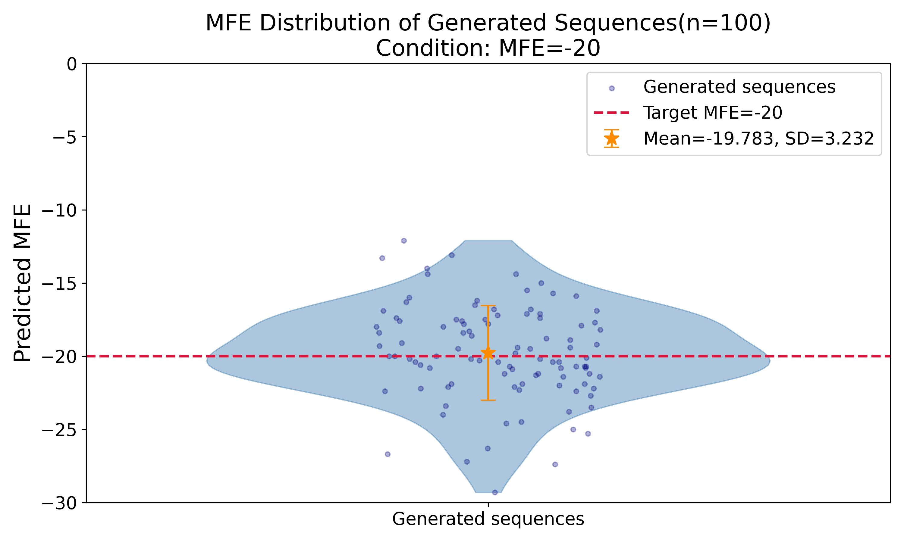
</p>

### 4. Joint MRL–MFE generation

```bash
python demo.py --mrl 6 --mfe -10 --do-eval --out demo_output/mrl_mfe_demo.fasta
```

Result: joint MRL–MFE distribution for the requested label pair.

<p align="center">
  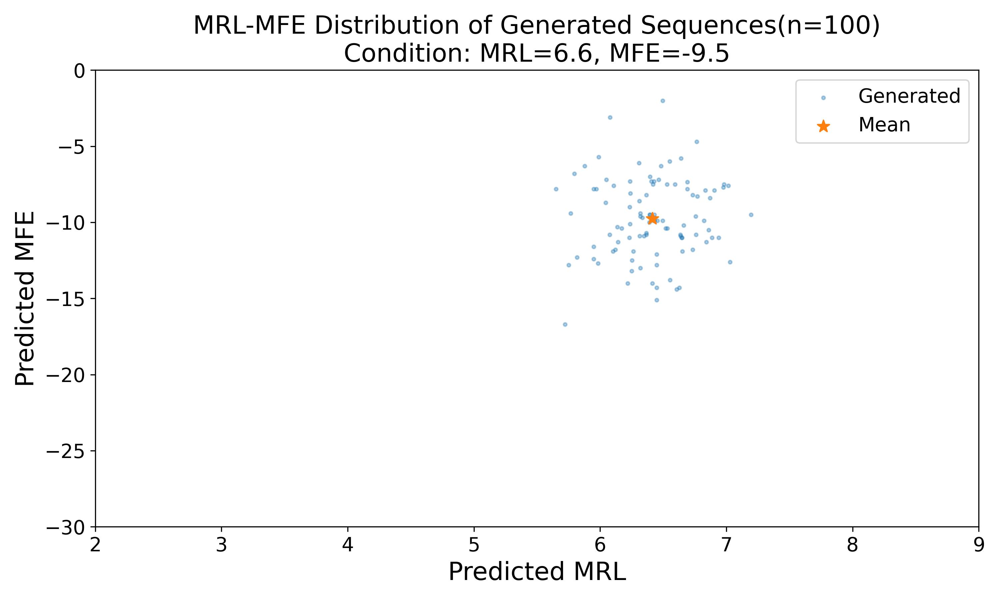
</p>

### 5. Base-constrained generation

`--base` fixes one or more three-nucleotide codons. Each position is a zero-based nucleotide start; `U` is accepted and normalized to `T`.

```bash
python demo.py --mrl 6 --mfe -10 \
  --base 2:AGC 8:GTG \
  --do-eval --out demo_output/base_demo.fasta
```

Results: the conditional MRL–MFE distribution and base-constraint diagnostics.

<p align="center">
  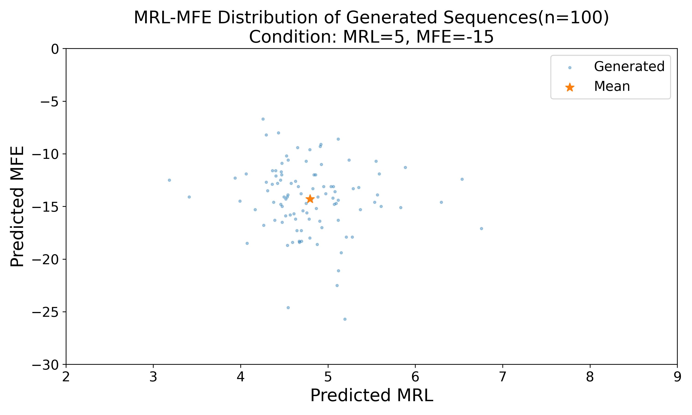
  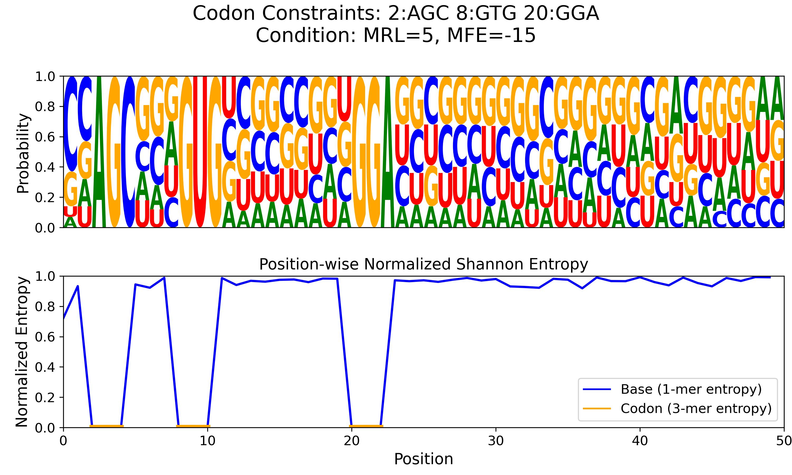
</p>

### 6. Amino-acid-constrained generation

`--amino` constrains amino acids at zero-based nucleotide starts. Positions need not be contiguous or share a reading frame.

```bash
python demo.py --mrl 6 --mfe -10 \
  --amino 26:M 31:D 37:L \
  --do-eval --out demo_output/amino_demo.fasta
```

Results: the conditional MRL–MFE distribution and amino-acid constraint diagnostics.

<p align="center">
  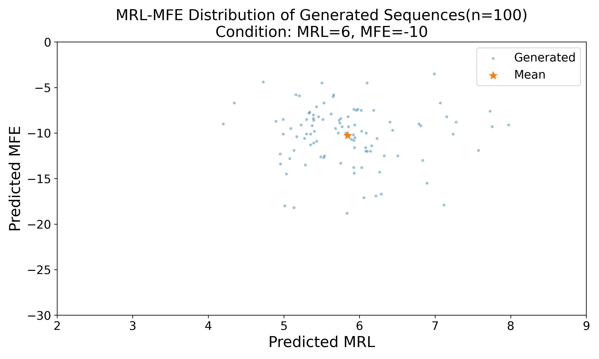
  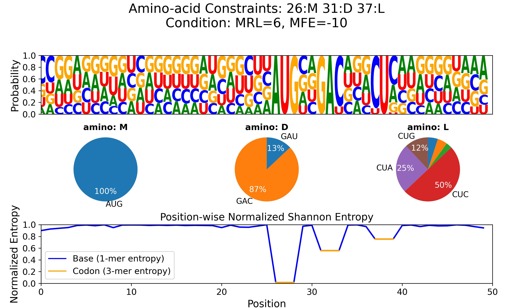
</p>

### 7. CAI-guided CDS generation

`--cds-amino` describes a complete contiguous coding suffix as `POSITION:AA` entries. It must begin with methionine (`M`), advance in three-nucleotide steps, and fill the suffix through nucleotide 49. `--cai` accepts a codon relative-adaptiveness target in `(0, 1]` and requires `--cds-amino`.

```bash
python demo.py --mrl 6 --mfe -10 --cai 0.7 \
  --cds-amino 32:M 35:A 38:G 41:L 44:K 47:L \
  --do-eval --out demo_output/cai_demo.fasta
```

Results: the conditional MRL–MFE distribution, CDS constraint diagnostics, and achieved sequence CAI distribution.

<p align="center">
  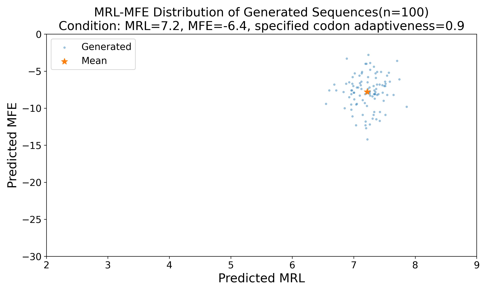
  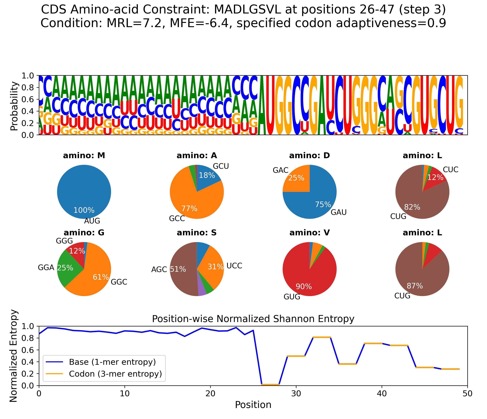
  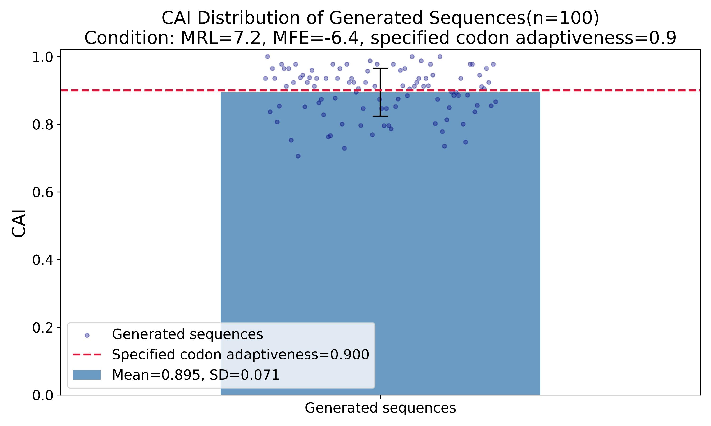
</p>

Only one of `--base`, `--amino`, and `--cds-amino` may be supplied in a run. For CDS outputs, achieved sequence CAI is calculated as the geometric mean of human codon relative adaptiveness over all downstream codons; the initiating AUG is excluded.

## Evaluation and output files

`--do-eval` is opt-in; omitting it generates only the FASTA file. With evaluation enabled, files are written beside the requested FASTA and existing files with the same names are overwritten:

- `NAME.fasta`: generated sequences;
- `NAME.csv`: predicted MRL/MFE values, plus achieved CAI for CDS-amino runs;
- `NAME_dist.jpg`: an MRL or MFE violin plot for single-label conditioning, otherwise an MRL–MFE scatter plot;
- `NAME_constraint.jpg`: sequence-logo, codon-choice, and entropy diagnostics for constrained generation; and
- `NAME_cai.jpg`: achieved CAI summary for CDS-amino generation.

The complete FASTA, CSV, and figure outputs for all seven demo modes are included in `demo_output/`.

## CLI options

| Option | Meaning |
| --- | --- |
| `--checkpoint` | MCML checkpoint path; default `checkpoints/mcml_epoch_2000.pt` |
| `--mrl` | Optional MRL target |
| `--mfe` | Optional MFE target |
| `--cai` | Codon relative-adaptiveness target in `(0, 1]`; requires `--cds-amino` |
| `--base` | One or more exact `POSITION:CODON` constraints |
| `--amino` | One or more sparse `POSITION:AA` constraints |
| `--cds-amino` | Complete contiguous suffix as `POSITION:AA` entries |
| `--out` | Output `.fasta` path; default `demo_output/demo.fasta` |
| `--batch-size` | Number of sequences; default 100 |
| `--cond-weight` | Classifier-free guidance weight; default 4.0 |
| `--do-eval` | Run the bundled evaluator and create plots; false unless specified |
| `--eval-repo` | Evaluation directory override; default `evaluation` |
| `--device` | PyTorch device; default `cuda:0` |

Run `python demo.py --help` for the complete interface.

## Training and diagnostic sampling

The final checkpoint was trained by `src/scripts/train_mcml.py` with `UNet_Masked_Continuous_Multi_Labels` and `Diffusion_Masked_Continuous_Multi_Labels`. The training CSV files are not distributed. To reproduce training, place the following files under `data/HEK293/`:

- `real_MRL_pred_MFE_260k.csv`;
- `real_MRL_pred_MFE_260k_missing_MFE.csv`; and
- `real_MRL_pred_MFE_260k_missing_MRL.csv`.

Run the entry points as modules from the repository root:

```bash
python -m src.scripts.train_mcml
python -m src.scripts.sample_mcml
```

Training outputs and checkpoints under `outputs/` are intentionally excluded from Git.

## Licensing

This repository does not currently declare a repository-wide license. Bundled and derived third-party components retain their own terms; see [THIRD_PARTY_NOTICES.md](THIRD_PARTY_NOTICES.md) before redistribution or commercial use.
